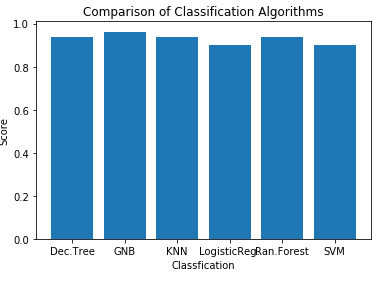

<h1 align="center">

</h1> 

# Graduate Admission Analysis

  

This project provides a comprehensive analysis of the factors influencing admission to graduate programs. Using a dataset from Kaggle, this notebook explores various machine learning models to predict the likelihood of admission based on explanatory variables such as GRE scores, TOEFL scores, and CGPA.
  

<h1 align="center">

</h1> 

## 🔑 Key Feature

### Exploratory Data Analysis:

  
  
  
  

- Visualize relationships between GRE scores, TOEFL scores, and CGPA with chances of admission.
- Statistical summaries to understand data distribution and correlation among different features.
  
  

### Predictive Modeling:

  
  

- Application of several machine learning models including Linear Regression, Decision Trees, and Random Forest to predict admission probabilities.
- Evaluation of model performance using metrics like R-squared and Mean Squared Error.

  

### Feature Importance Analysis:

Identification of key features that impact admission chances through model coefficients and feature importance scores.
This analysis aims to provide prospective students with insights into how their profiles align with the admission criteria of graduate programs, thus aiding them in making informed decisions about where to apply.
  

## 🧠 Skills
- Python
- Data Manipulation with pandas
- Data Visualization with Matplotlib and Seaborn
- Predictive Modeling with Scikit-Learn
- Statistical Analysis
- Statistical Analysis

## 🦾Future Work
- Model Improvement: Further tuning of model parameters and exploring ensemble methods to enhance prediction accuracy.
- Data Enrichment: Incorporating more contextual data such as applicant demographics and extracurricular activities to refine the models.
- Deployment: Developing a web-based application where prospective students can estimate their admission chances based on their profiles.
